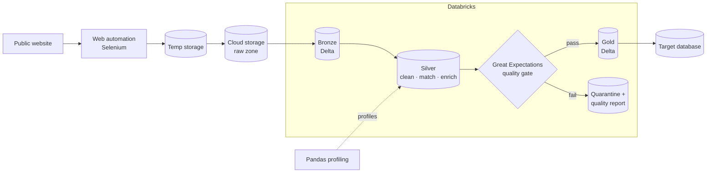

# Grant Data Integration Pipeline (Databricks)

> Automated, quality-gated integration of public grant data into a governed data platform · **~2023** · Databricks pipeline

**Role:** Data & AI Platform Architect (Lead Data Engineer)
**Type:** Portfolio case study — architecture & approach are representative; production code is proprietary.

---

## Context

A public source published grant data that needed to flow — reliably and accurately — into an existing data platform to enrich it. Manual extraction was brittle (the website changed, forms broke) and there were no systematic data-quality guarantees, so trust in the integrated data was low.

This project (**circa 2023**) built an end-to-end automated pipeline on **Databricks** with **data quality as a first-class concern**: web automation for extraction, cloud storage for staging, **PySpark/Delta** transformation and matching, and **Great Expectations** validation gates with profiling. It is the **production-pipeline** stage of my journey — where reliability, validation, lineage and reusability mattered as much as the transform itself.

## Architecture

## Tech stack

- **Platform:** Databricks (Apache Spark)
- **Processing:** PySpark, Delta Lake
- **Extraction:** Selenium web automation; Python (Requests, Beautiful Soup), boto3, Pandas; fuzzy matching
- **Data quality:** Great Expectations (expectations + validation reports), data profiling
- **Orchestration:** Databricks Workflows (schedulable, reusable ingestion template)
- **Cloud storage:** S3 / Azure Blob (raw staging)

## Data model & architecture

- **Medallion with a quality gate** — Bronze (raw) → Silver (cleaned, fuzzy-matched, enriched against the existing source) → **validation** → Gold (publish-ready Delta).
- **Quarantine path** — records failing expectations are diverted with a quality report rather than silently dropped or polluting Gold.
- **Reusable ingestion template** — a parameterized pattern so future sources onboard consistently instead of as one-off scripts.
- **Lineage** tracked through the layers for integrity and traceability.

## Key design decisions

- **Validate before you publish** — Great Expectations gates between Silver and Gold mean only data meeting defined expectations reaches consumers.
- **Quarantine, don't discard** — failed records are captured and reported so issues are visible and fixable, not lost.
- **Template the pipeline** — a standardized, parameterized ingestion pattern turns each new source into configuration, not new code.
- **Automate the brittle edge** — resilient web automation with error handling absorbs upstream form/website changes that used to break extraction.

## Outcome & impact

- **Trustworthy integration** — quality gates and profiling raised confidence in the enriched data.
- **Hands-off operation** — automated extraction-to-load removed manual, error-prone steps and improved team efficiency.
- **Faster onboarding of new sources** through the reusable ingestion template.
- **Auditable lineage** end to end, supporting governance and debugging.

## Where this sits in my journey

Part of my **Data & AI Platform Architect** portfolio — the **~2023 Databricks production-pipeline** stage.

⏮ prev: [customs-trade-analytics-databricks-pyspark](https://github.com/kamalakarpeta/customs-trade-analytics-databricks-pyspark) · ⏭ next: [financial-research-rag-databricks-genai](https://github.com/kamalakarpeta/financial-research-rag-databricks-genai)
Full journey: https://kamalakarpeta.github.io

## Contact

LinkedIn: https://www.linkedin.com/in/kamalakarpeta/
